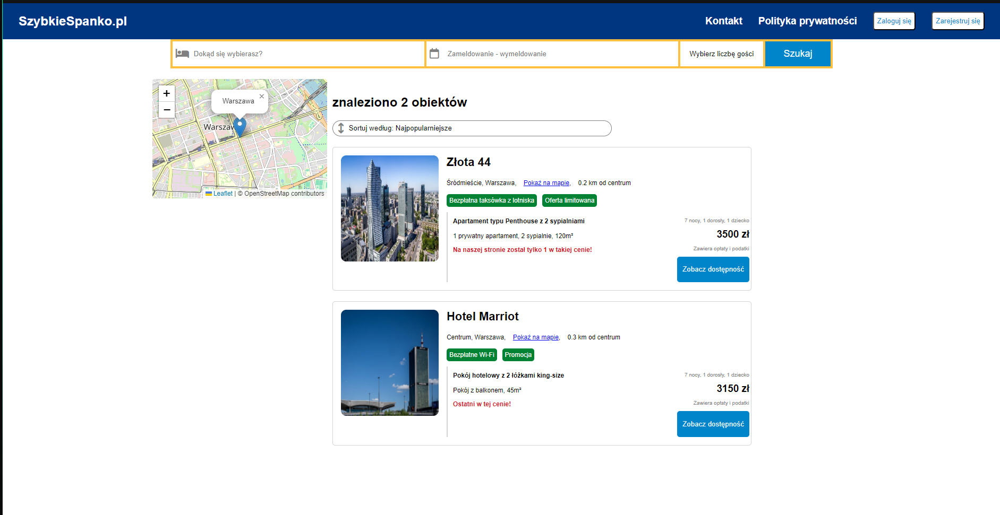

# Dynamic web app integrated with MySQL database - university project
> Web server handling reservation management integrated with MySQL.

## Table of Contents
* [General Info](#general-information)
* [Technologies Used](#technologies-used)
* [Features](#features)
* [Setup](#setup)
* [Api endpoints](#api-endpoints)
* [Usage](#usage)
* [Screenshots](#for-such-an-input-into-the-database-this-would-be-the-result)
* [Project Status](#project-status)
* [Contact](#contact)


## General Information
- This is a university project designed to demonstrate a fully functional web application for managing hotel reservations. The app integrates seamlessly with a MySQL database to provide dynamic features, including real-time reservation management, user input handling, and data storage.


## Technologies Used
- node.js - version 22.13.0
- express - version 4.21.2
- MySQL
- HTML5
- CSS3
- javascript
- postman


## Features
List the ready features here:
- Reservation Management - Users can book stays at selected dates, with real-time availability checks to prevent overlapping bookings.
- User Data Handling - The app collects and validates user information such as name, email, phone number, and country of origin during the reservation process.
- Dynamic Availability Display - The website dynamically updates the availability of rooms based on reservations stored in the MySQL database.
- Secure Data Storage - All reservation and user data is securely stored in a MySQL database.
- Interactive UI - A user-friendly interface that allows users to easily select rooms, input their data, and finalize their reservations.


## Setup
1. Install Node.js ([link:](https://nodejs.org/en))
2. Clone repository https://github.com/Srippo/Projekt-javascript-SzybkieSpanko.pl.git
3. Install dependencies (dependencies can be found in the dependencies.txt file) 
    - npm install
4. Configure a database in MySQL
    - Download the "Dump1 (structure)" file from this repository and import it into your database in MySQL. This step will provide your database with the necessary structure.
    - Or download the "Dump2 (structure and data) file from this repository and import it into your database in MySQL if you wish to check the app out with my database.
5. Create an .env file and insert
    - DB_USER=yourusername
    - DB_PASSWORD=yourpassword
    - DB_NAME=yourdatabasename
    - DB_SERVER=yourdatabaseservername
    - PORT=3000
6. Create connection to your database
7. Launch the API with node server.js


## Back-end

### API Endpoints
The back-end provides a set of API endpoints to manage reservations and user data. These endpoints allow users to create, read, and manage reservations while ensuring that booking conflicts are prevented. The system dynamically updates room availability based on data stored in the database.

### RDBMS and Data Persistence
This application uses MySQL as its relational database management system (RDBMS). MySQL ensures structured storage of data, including reservations, user details, and room availability. The application relies on SQL queries to interact with the database, handling operations such as data retrieval, insertion, and validation. All reservation data is persisted in MySQL, ensuring it can be retrieved, modified, or analyzed in the future.

## API Endpoints


Use Base URL: [http://localhost:3000/](http://localhost:3000/)

## API Endpoints

### Public Endpoints
1. **Home Page**
   - **URL:** `/`
   - **Method:** `GET`
   - **Description:** Serves the main webpage for the application.

2. **Search Results**
   - **URL:** `/results`
   - **Method:** `GET`
   - **Query Parameters:**
     - `city` (string, required): Name of the city to filter results.
   - **Response:** Returns a list of available properties in the specified city.
   - **Error Responses:**
     - `400`: City not provided.
     - `500`: Database connection error.

3. **City Coordinates**
   - **URL:** `/city-coordinates`
   - **Method:** `GET`
   - **Query Parameters:**
     - `city` (string, required): Name of the city to fetch coordinates.
   - **Response:** Latitude and longitude of the specified city.
   - **Error Responses:**
     - `400`: City not provided.
     - `404`: City not found.
     - `500`: Database connection error.

4. **Offer Details**
   - **URL:** `/offer-details`
   - **Method:** `GET`
   - **Query Parameters:**
     - `id` (integer, required): ID of the offer.
   - **Response:** Detailed information about the offer, including facilities and photos.
   - **Error Responses:**
     - `404`: Offer not found.
     - `500`: Server error.

5. **Reservation Details**
   - **URL:** `/reservation-details`
   - **Method:** `GET`
   - **Query Parameters:**
     - `id` (integer, required): ID of the reservation.
   - **Response:** Summary of the reservation, including name, image, and price.
   - **Error Responses:**
     - `400`: ID not provided.
     - `404`: Reservation not found.
     - `500`: Database connection error.

### Reservation Management
1. **Create Reservation**
   - **URL:** `/rezerwacja`
   - **Method:** `POST`
   - **Request Body:**
     ```json
     {
       "imie": "string",
       "nazwisko": "string",
       "email": "string",
       "telefon": "string",
       "miasto": "string",
       "data_zameldowania": "string (YYYY-MM-DD)",
       "data_wymeldowania": "string (YYYY-MM-DD)",
       "liczba_doroslych": "integer",
       "liczba_dzieci": "integer",
       "object_id": "integer"
     }
     ```
   - **Response:** Confirmation of the reservation.
   - **Error Responses:**
     - `400`: Missing `object_id`.
     - `500`: Server error.

2. **Check Existing Reservations**
   - **URL:** `/api/reservations/:objectId`
   - **Method:** `GET`
   - **Path Parameters:**
     - `objectId` (integer, required): ID of the object to check reservations for.
   - **Response:** List of reservations for the specified object.
   - **Error Responses:**
     - `500`: Database connection error.

3. **Create New Reservation with Conflict Check**
   - **URL:** `/api/reservations`
   - **Method:** `POST`
   - **Request Body:**
     ```json
     {
       "object_id": "integer",
       "data_zameldowania": "string (YYYY-MM-DD)",
       "data_wymeldowania": "string (YYYY-MM-DD)"
     }
     ```
   - **Response:** Confirmation of the reservation if no conflict exists.
   - **Error Responses:**
     - `400`: Conflicting reservation exists.
     - `500`: Database connection error.

### Object Details
1. **Fetch Object Details**
   - **URL:** `/obiekt/:id`
   - **Method:** `GET`
   - **Path Parameters:**
     - `id` (integer, required): ID of the object.
   - **Response:** Details of the specified object.
   - **Error Responses:**
     - `404`: Object not found.
     - `500`: Server error.

## Usage

### Adding a new object to the database
Below is an example of how to insert a new hotel into the database:
```sql
INSERT INTO Obiekty (id, object_name, city, avbl, price, max_quests, coords_lat, coords_lon, descript, address, address_line, postal_code, country, imageUrl, distance, attribute1, attribute1_description, attribute2, attribute2_description, roomDetails, roomDetailsDescription, urgent, rating, reveiws_count, descriptionLong)
VALUES (2, 'Hotel Marriot', 'Warszawa', true, 450, 5, 52.22755000, 21.00411800, 'Luksusowe pokoje w słynnym hotelu Marriot', 'Centrum, Warszawa', 'Aleje Jerozolimskie', '00-698', 'Polska', images/Marriot.jpg, 0.3, 'Bezpłatne Wi-Fi', 'Darmowe Wi-Fi dostępne w całym obiekcie.', 'Promocja', 'Tylko dzisiaj niższa cena!', 'Pokój hotelowy z 2 łóżkami king-size', 'Pokój z balkonem, 45m²', 'Ostatni w tej cenie!', 9.2, 250, 'long description');
```

### Adding facilities to the database
Below is an example of how to insert facilities which display on the offer page:
```sql
INSERT INTO facilities (id, name, icon)
VALUES (1, 'Fantastyczne śniadanie', 'fa-solid fa-mug-saucer');
```

### Asigning facilities to objects
Below is an example of how to assign a facility to the previously added hotel:
```sql
INSERT INTO obiekty_facilities (object_id, facility_id)
VALUES (2, 1);
```

### Asigning images to objects
Below is an example of how to assign your images to the previously added hotel:
```sql
INSERT INTO obiekty_images (id, object_id, image_url)
VALUES (1, 2, /images/objects/yourimg);
```

### Adding cities to the database
Below is an example of how to add cities to the database:
```sql
INSERT INTO miasta (id, city, latitude, longtitude)
VALUES (1, 'Warszawa', '52.22967500', '21.01223000');
```


### For such an input into the database, this would be the result.




## You may also use Dump (structure and data) if you want to check out the app with my database.

## Project Status
Project is: _in progress_

## Contact
Created by Srippo (filip.szreder.slupsk@gmail.com) and PiasKar (piaskar2004@gmail.com) - feel free to contact us!
